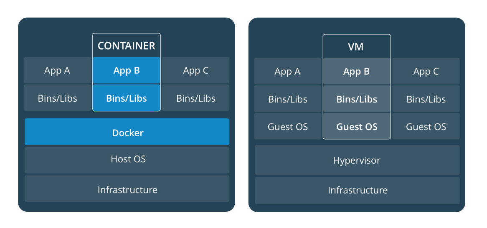

## Third meeting
## Docker

Docker is one of the tools to use containers, what is containers ?
containers is
```
a lightweight, stand-alone, executable package of a
piece of software that includes everything needed to
run it: code, runtime, system tools, system libraries,
settings.
```
### Why using Docker ?
#### lightweight
- Containers running on a single machine share that machine's operatng system kernel; they start   instantly and use less compute and RAM.
- Images are constructed from flesystem layers and share common fles. his minimizes disk usage and image downloads are much faster.

#### Standard
- Containers are based on open standards and run on all major Linux distributons, Microsof Windows, and on any infrastructure including VMs, bare-metal and in the cloud.

#### Secure
- Docker containers isolate applicatons from one another and from the underlying infrastructure. Docker provides the strongest default isolaton to limit app issues to a single container instead of the entre machine.

For comparison with Virtual machines as we have used, we can see the following picture :


for full documentation, access [this](https://docs.docker.com/)

### Let's Hand on
Requirements:
- [x] Virtual Machine with Linux Or Windows (sample using ubuntu 16.04)
- [x] Internet connection
- [x] Requires enthusiasm and patience

#### Installation
1. Using Ubuntu
```
sudo apt -y install docker.io
sudo systemctl status docker
```
2. Using CentOs
```
yum -y install docker
```
3. Using Windows and Mac
  - Download File installer [this](https://docs.docker.com/docker-for-windows/install/)
4. Verify Docker install
```
docker --version
docker version
docker info
```

#### Simple Lab
1. First Applicatons
```
docker run hello-world
#list images
docker image ls
#show list Container active or inactive
docker container ls -a
```
2. Try another application
```
docker run docker/whalesay cowsay nameapp
#show image list
docker image ls
```
Other images, you can see on [this](https://hub.docker.com)


#### DockerFile

Create your own image with Dockerfile, in this session, we will create our own image according to the needs of our application using Dockerfile
##### Simple
1. Create Project Folder
```
mkdir -p latihan/aplikasi01
cd latihan/aplikasi01
```

2. Create Dockerfile File
```
vi Dockerfile
```
**note : Press the 'i' button, to edit and click 'esc' when finished then write ':wq'**

If you have difficulty using the following text editor
```
nano Dockerfile
```

**fill the file with the following code**
``
FROM docker/whalesay:latest


RUN apt -y update && apt install -y fortunes

CMD /usr/games/fortune -a | cowsay
```
3. Build Image and Run Image
```
docker build -t firstapp .
docker image ls
docker run firstapp
```

##### Medium
1. Create Project Folder
```
**returned from the previous project folder**
cd ..
**create folder**
mkdir -p aplikasi02
cd aplikasi02
```

2. Create Dockerfile File
```
vi Dockerfile
```
**note : Press the 'i' button, to edit and click 'esc' when finished then write ':wq'**

If you have difficulty using the following text editor
```
nano Dockerfile
```

**fill the file with the following code**
```
**Use an official Python runtime as a parent image**
FROM python:2.7-slim

**Set the working directory to /app**
WORKDIR /app

**Copy the current directory contents into the container at /app**
ADD . /app

**Install any needed packages specified in requirements.txt**
RUN pip install --trusted-host pypi.python.org -r requirements.txt

**Make port 80 available to the world outside this container**
EXPOSE 80

**Define environment variable**
ENV NAME World

**Run app.py when the container launches**
CMD ["python", "app.py"]
```
3. Create additional file needs from the application
**First file**
```
vi requirements.txt
**or use this editor text**
nano requirements.txt
```
**fill the file with the following text**
```
Flask
Redis
```
**Second file**
```
vi app.py
#or use this editor text
nano app.py
```
**fill the file with the following code**
```
from flask import Flask
from redis import Redis, RedisError
import os
import socket

# Connect to Redis
redis = Redis(host="redis", db=0, socket_connect_timeout=2, socket_timeout=2)

app = Flask(__name__)

@app.route("/")
def hello():
    try:
        visits = redis.incr("counter")
    except RedisError:
        visits = "<i>cannot connect to Redis, counter disabled</i>"

    html = "<h3>Hello {name}!</h3>" \
           "<b>Hostname:</b> {hostname}<br/>" \
           "<b>Visits:</b> {visits}"
    return html.format(name=os.getenv("NAME", "world"), hostname=socket.gethostname(), visits=visits)

if __name__ == "__main__":
    app.run(host='0.0.0.0', port=80)
```
4. Build Image and Run Image
```
docker build -t secondapp .
#Verify
docker image ls
#Run image
docker run -d -p 4000:80 secondapp
#check application
curl http://localhost:4000
```

#### Publish Image

1. Login into docker hub
Create account [sign up](https://hub.docker.com/signup)
```
sudo docker login
```
2. Give on image
```
docker tag secondapp [USER]/latihan:aplikasi02
docker image ls
```
3. Push Image
```
docker push [USER]/latihan:aplikasi02
```
4. Test Running image from hub
```
docker run -d -p 4000:80 [USER]/latihan:aplikasi02
docker container ls
curl http://localhost:4000
```


#### Additional
```
#stop container
docker container stop [CONTAINER ID]
#delete container
docker container rm [CONTAINER ID]
#delete image
docker image rm [IMAGE]
```
