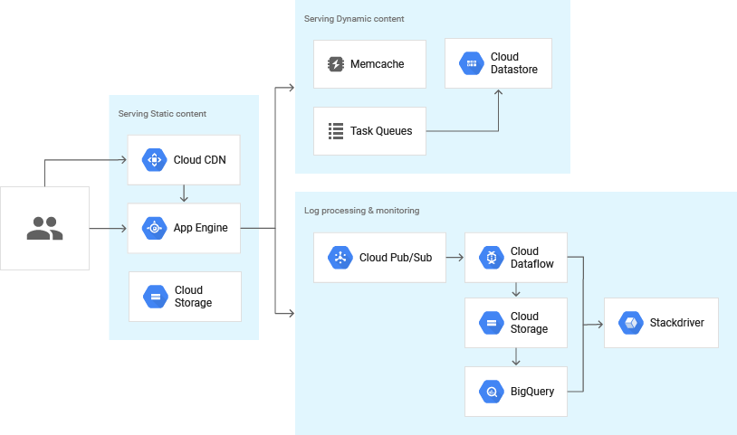
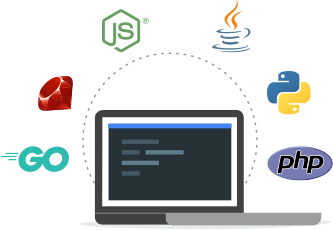
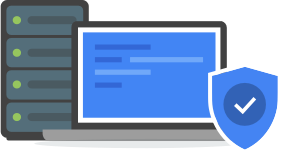
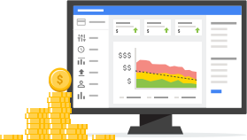
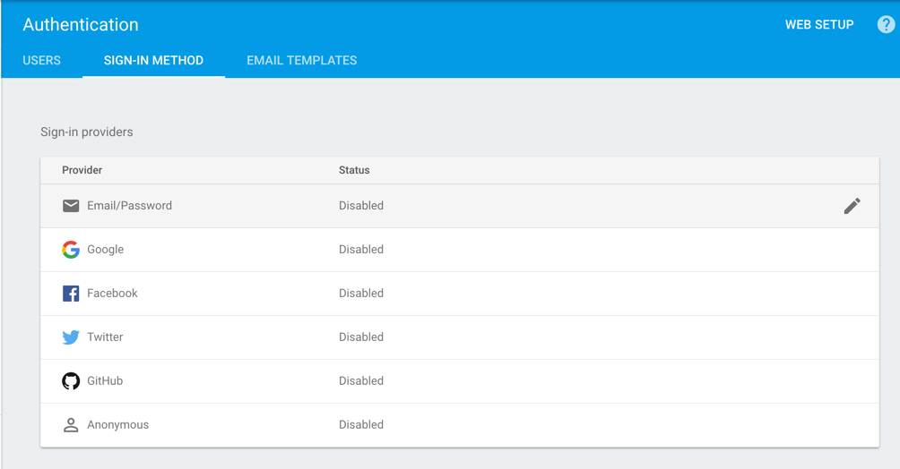
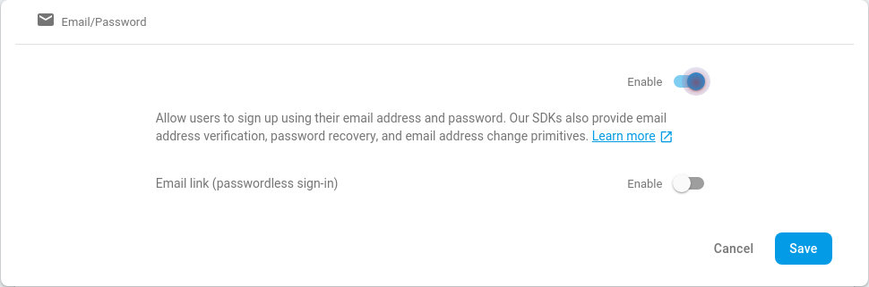

# How to delploy your Apps using App Engine

## Overview




Build and deploy applications on a fully managed platform. Scale your applications seamlessly from zero to planet scale without having to worry about managing the underlying infrastructure. With zero server management and zero configuration deployments, developers can focus only on building great applications without the management overhead. App Engine enables developers to stay more productive and agile by supporting popular development languages and a wide range of developer tools.

- Open and familiar languages and tools



Quickly build and deploy applications using many of the popular languages like Java, PHP, Node.js, Python, C#, .Net, Ruby, and Go or bring your own language runtimes and frameworks if you choose. Get started quickly with zero configuration deployments in App Engine. Manage resources from the command line, debug source code in production, and run API backends easily, using industry-leading tools such as Cloud SDK, Cloud Source Repositories, IntelliJ IDEA, Visual Studio, and PowerShell.

- Just add code



Focus just on writing code, without the worry of managing the underlying infrastructure. With capabilities such as automatic scaling-up and scaling-down of your application between zero and planet scale, fully managed patching and management of your servers, you can offload all your infrastructure concerns to Google. Protect your applications from security threats using App Engine firewall capabilities, identity and access management (IAM) rules, and managed SSL/ TLS certificates.

- Pay only for what you use



Choose to run your applications in a serverless environment without the worry of over or under provisioning. App Engine automatically scales depending on your application traffic and consumes resources only when your code is running. You will only need to pay for the resources you consume.

## Features

- Popular languages
- Open and flexible
- Fully managed
- Monitoring, logging, and diagnostics
- Application versioning
- Traffic splitting
- Application security
- Services ecosystem


## Before You begin

1. Download and install Google sdk [Download dan Install](https://cloud.google.com/sdk/docs/)
2. If you already Install, update component
```
gcloud components update
```
3. Create new Project or use already Project
- Create Project
```
gcloud projects create myproject --set-as-default
```

- Set Project

```
 gcloud config set project myproject
```

4. Initialize your App Engine app with your project and choose its region:
```
gcloud app create --project=myproject
```

5. Install the following prerequisites:
- Git [Download and install](https://git-scm.com/)
- Python3 component on gcloud

```
gcloud components install app-engine-python
```

- Setup your python environment, in local machine
[Linux](Linux/README.md) , [Windows](Windows/README.md), or [MacOs](Mac/README.md)

## Sample App 1 , Hello World

### Run Hello World on your local machine (Stage 1)

1. Clone the Hello World sample app repository to your local machine.

```
git clone https://github.com/sulaimantok/DSC-MEET20.git
```
2. Change to the directory that contains the sample code.

```
cd DSC-MEET20/M4/Apps/hello_world/
```
3. install Requirements

```
pip install  -r requirements.txt
```

4. Run the Application:

```
python main.py
```

5. In your web browser, enter the following address: 

```
http://localhost:8080
```
or

```
curl http://localhost:8080
```

### Deploy and run Hello World on App Engine (Stage 2)

1. In same directory(project directory), in this case hello_world

```
gcloud app deploy
```

2.  Launch your browser to view the app at https://myproject.southeast1-a.r.appspot.com

note: in this case "myproject" is project ID, you can change with own project ID
, and "southeast1-a" is Region

```
gcloud app browse
```

## Sample App 2 , Building Sample App


Write and locally test a web service that serves a static HTML file using Flask. Then, create the configuration files that you need for deploying the web service to App Engine.

In this step, you create and locally test a version of a web service that displays placeholder data. The goal here is to ensure that your basic web service is working before adding Datastore and Firebase authentication.

### Run Sample Aps on your local machine (Stage 1)

1. Change to the directory that contains the sample code.

```
cd DSC-MEET20/M4/Apps/building_app/
```
2. install Requirements

```
pip install  -r requirements.txt
```

3. Run the Application:

```
python main.py
```

4. In your web browser, enter the following address: 

```
http://localhost:8080
```
or

```
curl http://localhost:8080

```

### Deploy and run Sample app on App Engine (Stage 2)

1. In same directory(project directory), in this case building_app

```
gcloud app deploy
```

2.  Launch your browser to view the app at https://myproject.southeast1-a.r.appspot.com

note: in this case "myproject" is project ID, you can change with own project ID
, and "southeast1-a" is Region

```
gcloud app browse
```

### Storing and Retrieving Data with Datastore (Stage 3)

1. Add the following code to your main.py file:

```python
from google.cloud import datastore

datastore_client = datastore.Client()

def store_time(dt):
    entity = datastore.Entity(key=datastore_client.key('visit'))
    entity.update({
        'timestamp': dt
    })

    datastore_client.put(entity)


def fetch_times(limit):
    query = datastore_client.query(kind='visit')
    query.order = ['-timestamp']

    times = query.fetch(limit=limit)

    return times
```

2. Update your root method to call your new methods:

```python
@app.route('/')
def root():
    # Store the current access time in Datastore.
    store_time(datetime.datetime.now())

    # Fetch the most recent 10 access times from Datastore.
    times = fetch_times(10)

    return render_template(
        'index.html', times=times)
```

3. Update your templates/index.html file to print the timestamp of each entity:

```html
<h2>Last 10 visits</h2>
  <p>{{ time['timestamp'] }}</p>

```

4. Ensure that your requirements.txt file includes all necessary dependencies:

```
Flask==1.1.1
google-cloud-datastore==1.10.0
```
5. Testing your web service

```
pip install -r requirements.txt
python main.py
```
Try access again:

```
http://localhost:8080
```
if success, deploy again with same tutorial [Deploy](#deploy-and-run-sample-app-on-app-engine-(stage-2))


### Adding Firebase to your Web Service (Stage 4)

##### Adding Firebase to your Cloud project

1. Add Firebase to your existing Cloud project using the Add project tool in the [Firebase console](https://console.firebase.google.com/u/0/?pli=1)

2. Enable the authentication sign-on providers in the Firebase console. For this web service, you will enable Email/Password and Google sign-in providers:

- Click **Develop** > **Authentication** > **Sign-in method**.
- Under **Sign-in providers**, hover the cursor over the **Email/Password provider** and click the pencil icon.



- Toggle the Enable button to use **Email/Password** authentication.



- After enabling the provider, click **Save**.
- Do the same thing for the sign-in provider **Google**.

3. For Firebase to authenticate properly, your domain needs to be authorized for OAuth redirects. To authorize your domain, scroll down to Authorized Domains on the Sign-in method page, click Add Domain,and then enter the domain of your app on App Engine, excluding the http:// prefix:

```
https://myproject.southeast1-a.r.appspot.com
```

##### Adding Firebase to your web service

1. Go to the [Firebase console](https://console.firebase.google.com/u/0/?pli=1) and select your project.

2. From the project overview page, under the text **Get started by adding Firebase to your app**, select **web**. If you already have an app added to the project, you may not see this text; instead, navigate to the settings page of your existing app or select **add app**.

3. Once the app is registered, a customized code snippet will be displayed. Copy the contents of the snippet. To see this code snippet again later, navigate to the **settings** page for your Firebase app.

4. Update your templates/index.html file by completing the following:

- Add your customized code snippet in the <head> tag of your templates/index.html file. Your custom code will look similar to this mock snippet:

```html
<!-- MOCK SNIPPET: DO NOT COPY -->
<!-- The core Firebase JS SDK is always required and must be listed first -->
<script src="https://www.gstatic.com/firebasejs/7.8.0/firebase-app.js"></script>

<!-- TODO: Add SDKs for Firebase products that you want to use
     https://firebase.google.com/docs/web/setup#available-libraries -->

<script>
  var config = {
    apiKey: "<API_KEY>",
    authDomain: "<PROJECT_ID>.firebaseapp.com",
    databaseURL: "https://<DATABASE_NAME>.firebaseio.com",
    projectId: "<PROJECT_ID>",
    storageBucket: "<BUCKET>.appspot.com",
    messagingSenderId: "<SENDER_ID>",
  };
  firebase.initializeApp(config);
</script>
```

- Replace the TODO in the snippet above with the following script tag to enable the Authentication component of Firebase:

```html
 <script src="https://www.gstatic.com/firebasejs/7.8.0/firebase-auth.js">
```

- Add the following lines in the <head> tag of your templates/index.html file to import the Firebase JavaScript and CSS files:

```html
<script src="https://www.gstatic.com/firebasejs/ui/4.4.0/firebase-ui-auth.js"></script>
<link type="text/css" rel="stylesheet" href="https://www.gstatic.com/firebasejs/ui/4.4.0/firebase-ui-auth.css" />
```

- Replace the current body of your index.html file with the following code, which you will use later in this guide to display authenticated user data:

```html
<h1>Datastore and Firebase Auth Example</h1>

<div id="firebaseui-auth-container"></div>

<button id="sign-out" hidden=true>Sign Out</button>

<div id="login-info" hidden=true>
  <h2>Login info:</h2>
      <dl>
      <dt>Name</dt><dd>{{ user_data['name'] }}</dd>
      <dt>Email</dt><dd>{{ user_data['email'] }}</dd>
      <dt>Last 10 visits</dt><dd>
                  <p>{{ time['timestamp'] }}</p>
         </dd>
    </dl>
      <p>Error: {{ error_message }}</p>
  </div>
```

- To add the behaviors required for an authentication flow, replace your static/script.js file's current event listener method with the following code:

```javascript
window.addEventListener('load', function () {
  document.getElementById('sign-out').onclick = function () {
    firebase.auth().signOut();
  };

  // FirebaseUI config.
  var uiConfig = {
    signInSuccessUrl: '/',
    signInOptions: [
      // Comment out any lines corresponding to providers you did not check in
      // the Firebase console.
      firebase.auth.GoogleAuthProvider.PROVIDER_ID,
      firebase.auth.EmailAuthProvider.PROVIDER_ID,
      //firebase.auth.FacebookAuthProvider.PROVIDER_ID,
      //firebase.auth.TwitterAuthProvider.PROVIDER_ID,
      //firebase.auth.GithubAuthProvider.PROVIDER_ID,
      //firebase.auth.PhoneAuthProvider.PROVIDER_ID

    ],
    // Terms of service url.
    tosUrl: '<your-tos-url>'
  };

  firebase.auth().onAuthStateChanged(function (user) {
    if (user) {
      // User is signed in, so display the "sign out" button and login info.
      document.getElementById('sign-out').hidden = false;
      document.getElementById('login-info').hidden = false;
      console.log(`Signed in as ${user.displayName} (${user.email})`);
      user.getIdToken().then(function (token) {
        // Add the token to the browser's cookies. The server will then be
        // able to verify the token against the API.
        // SECURITY NOTE: As cookies can easily be modified, only put the
        // token (which is verified server-side) in a cookie; do not add other
        // user information.
        document.cookie = "token=" + token;
      });
    } else {
      // User is signed out.
      // Initialize the FirebaseUI Widget using Firebase.
      var ui = new firebaseui.auth.AuthUI(firebase.auth());
      // Show the Firebase login button.
      ui.start('#firebaseui-auth-container', uiConfig);
      // Update the login state indicators.
      document.getElementById('sign-out').hidden = true;
      document.getElementById('login-info').hidden = true;
      // Clear the token cookie.
      document.cookie = "token=";
    }
  }, function (error) {
    console.log(error);
    alert('Unable to log in: ' + error)
  });
});
```

- Retrieve, verify, and decrypt the token in the root method of your main.py file:

```python
from flask import Flask, render_template, request
from google.auth.transport import requests
from google.cloud import datastore
import google.oauth2.id_token

firebase_request_adapter = requests.Request()
@app.route('/')
def root():
    # Verify Firebase auth.
    id_token = request.cookies.get("token")
    error_message = None
    claims = None
    times = None

    if id_token:
        try:
            # Verify the token against the Firebase Auth API. This example
            # verifies the token on each page load. For improved performance,
            # some applications may wish to cache results in an encrypted
            # session store (see for instance
            # http://flask.pocoo.org/docs/1.0/quickstart/#sessions).
            claims = google.oauth2.id_token.verify_firebase_token(
                id_token, firebase_request_adapter)
        except ValueError as exc:
            # This will be raised if the token is expired or any other
            # verification checks fail.
            error_message = str(exc)

        # Record and fetch the recent times a logged-in user has accessed
        # the site. This is currently shared amongst all users, but will be
        # individualized in a following step.
        store_time(datetime.datetime.now())
        times = fetch_times(10)

    return render_template(
        'index.html',
        user_data=claims, error_message=error_message, times=times)
```

- Ensure that your requirements.txt file includes all necessary dependencies:

```
Flask==1.1.1
google-cloud-datastore==1.10.0
google-auth==1.10.0
requests==2.22.0
```

- Test again,

```
pip install -r requirements.txt
python main.py
```
Try access again:

```
http://localhost:8080
```
if success, deploy again with same tutorial [Deploy](#Deploy and run Sample app on App Engine (Stage 2))

### Storing and retrieving user-specific data (Stage 5)

1. Update your store_time and fetch_time methods to use Datastore ancestors for storing and retrieving visit entities: (main.py)

```python
datastore_client = datastore.Client()

def store_time(email, dt):
    entity = datastore.Entity(key=datastore_client.key('User', email, 'visit'))
    entity.update({
        'timestamp': dt
    })

    datastore_client.put(entity)


def fetch_times(email, limit):
    ancestor = datastore_client.key('User', email)
    query = datastore_client.query(kind='visit', ancestor=ancestor)
    query.order = ['-timestamp']

    times = query.fetch(limit=limit)

    return times
```

2. Update the store_times method call in your root method and move it inside the id_token conditional so that it only runs if the server has authenticated a user: (main.py)

```python
@app.route('/')
def root():
    # Verify Firebase auth.
    id_token = request.cookies.get("token")
    error_message = None
    claims = None
    times = None

    if id_token:
        try:
            # Verify the token against the Firebase Auth API. This example
            # verifies the token on each page load. For improved performance,
            # some applications may wish to cache results in an encrypted
            # session store (see for instance
            # http://flask.pocoo.org/docs/1.0/quickstart/#sessions).
            claims = google.oauth2.id_token.verify_firebase_token(
                id_token, firebase_request_adapter)

            store_time(claims['email'], datetime.datetime.now())
            times = fetch_times(claims['email'], 10)

        except ValueError as exc:
            # This will be raised if the token is expired or any other
            # verification checks fail.
            error_message = str(exc)

    return render_template(
        'index.html',
        user_data=claims, error_message=error_message, times=times)
```

3. Create an index.yaml file in the root directory of your project, for example building-an-app, and add the following index:

```yml
indexes:

- kind: visit
  ancestor: yes
  properties:
  - name: timestamp
    direction: desc
```

4. Deploy your index.yaml indexes in Datastore by running the following command and following the prompts:

```
gcloud datastore indexes create index.yaml
```
5. Test again,

```
python main.py
```
Try access again:

```
http://localhost:8080
```
if success, deploy again with same tutorial [Deploy](#Deploy and run Sample app on App Engine (Stage 2))


To access full configuration code access [this link](https://github.com/sulaimantok/DSC-MEET20/tree/master/M4/Apps/fix_building_app)

any help:
telegram : @sulaiman2601